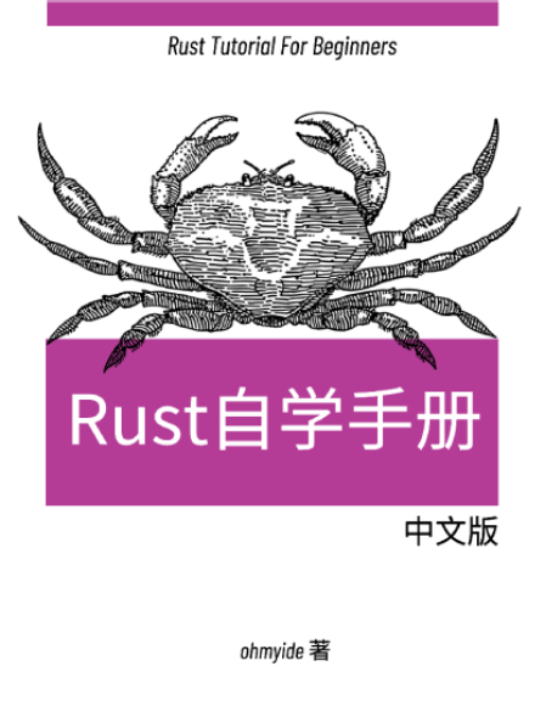

# rust-lessons
📕 Rust 自学手册

## About This Book 
Rust 是一门让人兴奋的语言，融合诸多高级语言的特性，从而兼顾内存安全、高并发和高性能：

- 拥有和 C、C++ 一样的高性能，又避免了手动管理内存的烦恼
- 有着高级语言的表达和抽象能力，又能直接操作内存

这么强悍的语言自然是有代价的，上手成本“颇为陡峭”：

> 如果你对Rust的概念认识的不完整，你完全写不出程序，那怕就是很简单的一段代码。 —— [左耳朵耗子](https://coolshell.cn/articles/20845.html)

本小册吸收诸多 Rust 书籍和资料，目标：总结一份快速上手 Rust 的「知识清单」，降低陡峭的学习曲线。

欢迎共建。